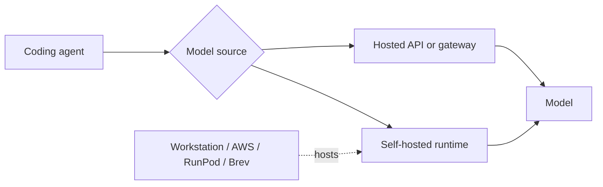

# Architecture and routing scenarios

The playground separates four independent choices:

1. **Coding agent** — Claude Code, OpenCode, Codex, Hermes, or another client.
2. **Model source** — a vendor API, hosted gateway, or self-hosted endpoint.
3. **Model** — the model selected for the main agent or a subagent.
4. **Deployment target** — where a self-hosted runtime executes.

## Terminology

- **Hosted**: another organization operates the inference endpoint, such as a
  model vendor or OpenRouter.
- **Self-hosted**: you operate the runtime and endpoint. It may be on your own
  workstation or on a rented remote machine.
- **Local URL**: an address such as `127.0.0.1`. With an SSH tunnel, that URL can
  terminate at a remote self-hosted server, so it says nothing about physical
  placement.
- **Deployment target**: the compute that hosts a self-hosted runtime. AWS,
  RunPod, and NVIDIA Brev belong here, not in the model-source layer.

## Routing scenarios

| Scenario | Main agent | Subagent | Example |
| --- | --- | --- | --- |
| Vendor managed | Hosted vendor API | Same vendor API | Claude Code routes main work to Sonnet and smaller work to Haiku |
| Hosted gateway | Hosted gateway | Hosted gateway | OpenCode selects different DeepSeek models through OpenRouter |
| Hybrid | Hosted gateway | Self-hosted endpoint | Main work uses a hosted model while a subagent uses a self-hosted Gemma model |
| Fully self-hosted | Self-hosted endpoint | Self-hosted endpoint | Main and subagents use different Qwen/Gemma models on user-operated runtimes |

Main-agent and subagent routing is an integration capability. The selected
models may share one endpoint or use independent sources. A self-hosted source
can also move between a workstation and cloud GPU without changing the logical
agent topology; only its endpoint and deployment configuration change.
